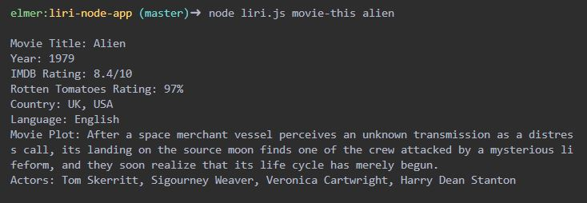

<h1 align="center">Welcome to LiRI Node App 👋</h1>
<p>
  
  
</p>

> LIRI is a command line interpretation and recognitions language interface. LIRI takes in parameters and gives back data from Spotify songs, Bands in Town for concerts and OMDB for movies' information.

## Prerequisites

- npm >=5.5.0
- node >=9.3.0

## Install

```sh
npm install
```
Next, create a file named `.env`, add the following to it, replacing the values with your Spotify API keys (no quotes):

```js
# Spotify API keys

SPOTIFY_ID=your-spotify-id
SPOTIFY_SECRET=your-spotify-secret

```
* To acquire the Spotify API keys, visit <https://developer.spotify.com/my-applications/#!/>

## Usage

```sh
node liri movie-this <movie-name>
node liri spotify-this-song <song-name>
node liri concert-this <artist-name>
```

## Screenshots




## Built With

* [Axios](https://www.npmjs.com/package/axios) - Promise based HTTP client for the browser and node.js
* [Bands in Town API](https://artists.bandsintown.com/support/bandsintown-api) - Bandsintow api is design to list an artist's events.
* [Dotenv](https://www.npmjs.com/package/dotenv) - Dotenv is a zero-dependency module that loads environment variables from a .env file into process.env.
* [Moment](https://momentjs.com/) - Parse, validate, manipulate, and display dates and times in JavaScript.
* [Node-Spotify-API](https://www.npmjs.com/package/node-spotify-api) - A simple to use API library for the Spotify REST API.
* [OMDB API](http://www.omdbapi.com/) - The OMDb API is a RESTful web service to obtain movie information.

## Author

👤 **Elmer C. Galo**

* Github: [@galoelmer](https://github.com/galoelmer)

## Show your support

Give a ⭐️ if this project helped you!

## 📝 License

Copyright © 2019 [Elmer C. Galo](https://github.com/galoelmer).<br />
This project is [MIT](https://github.com/kefranabg/readme-md-generator/blob/master/LICENSE) licensed.